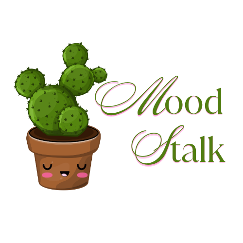

# 🌿 Moodstalk

**Moodstalk** is a UI/UX concept that connects human emotion with plant-based inspiration.  
It matches your current mood to indoor plants like Snake Plant, Monstera and Calathea.

## 💡 What This Project Includes:
- 🎨 Logo and branding assets
- 📱 Splash screen wireframe concept
- ✍️ Medium case study draft

## 🛠 Tools Used:
Figma, Canva, Procreate

## 🔮 Mood Themes:
- Joy → African Violet
- Calm → Snake Plant
- Focus → ZZ Plant
- Lonely → Pothos
- Creative → Calathea
- Overwhelmed → Aloe Vera

## 📸 Preview

## ✍️ Blogpost
> Coming soon to Medium...

---